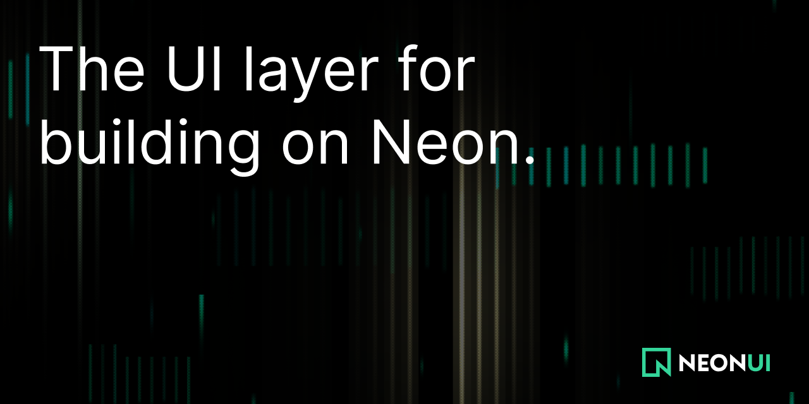

<p align="center">
  
</p>

<div align="center">

**Neon UI** is a [shadcn registry](https://ui.shadcn.com/docs/registry) of production-ready components for agent platforms built on [Neon](https://neon.com). Nothing to install as a package: component source lands in your project, and it's your code from that point on.

[Docs](https://ui.neon.com) · [Components](https://ui.neon.com/platform/app-card) · [Neon](https://neon.com)

</div>

<p align="center">
  <a href="https://ui.neon.com"></a>
  <a href="https://neon.com"></a>
</p>

## Usage

Add any component straight from the registry:

```bash
npx shadcn@latest add https://ui.neon.com/r/auth-form.json
```

Every component ships presentational-first (data in as props, typed examples for the real Neon wiring), reduced-motion safe, on React 19, Tailwind v4, and Base UI.
